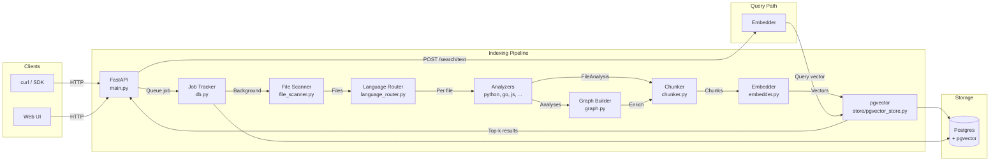

# Architecture

## Overview

The Code Indexer Service is a Python/FastAPI HTTP service that turns codebases
into searchable vector databases. It clones or receives source code, parses it
into structured symbols (functions, classes, imports), builds relationship
graphs, generates vector embeddings, and stores everything in Postgres/pgvector
for semantic search.



## Core Components

### 1. API Layer (`main.py`)

The FastAPI application that exposes all HTTP endpoints. Built with:

- **FastAPI** with Pydantic v2 request/response models
- **Background tasks** for long-running indexing jobs
- **Bearer token auth** on management endpoints (upload, delete, job status)
- **Webhook notifications** with optional HMAC-SHA256 signatures

**Endpoints:**

| Endpoint | Purpose |
|----------|---------|
| `POST /github/index` | Queue a GitHub repo or local path for indexing |
| `POST /embeddings/{ns}/{pid}` | Upload a zip and index it |
| `POST /search/text` | Search with raw query text (auto-picks model) |
| `POST /search` | Search with a pre-computed embedding vector |
| `POST /embed` | Embed arbitrary text |
| `GET /embeddings/{ns}/{pid}` | Read index metadata |
| `DELETE /embeddings/{ns}/{pid}` | Delete a project's index |
| `GET /jobs/{job_id}` | Poll indexing job status |
| `GET /` | Serve the built-in API documentation UI |

### 2. Database Layer (`db.py`)

Manages a Postgres connection pool via `psycopg2` and provides:

- **Schema initialisation** — Creates `jobs`, `index_meta`, and `embeddings`
  tables with the `vector` extension on startup.
- **Job CRUD** — Create, update, and poll indexing jobs with status tracking
  (`queued → downloading → running → completed/failed`).
- **Index metadata** — Stores which embedding model and dimension were used for
  each project, enabling automatic model selection at query time.
- **Embedding storage** — `upsert` semantics with `(namespace, project_id, chunk_id)`
  uniqueness so re-indexing updates vectors in place.

The `embeddings` table stores `vector(768)` columns (CodeBERT dimension) with an
IVFFlat cosine-similarity index. If the table was previously created with a
different dimension it is automatically dropped and recreated.

### 3. File Scanning (`utils/file_scanner.py`)

Walks a repository tree and yields source file paths. Prunes:

- VCS directories (`.git`, `.svn`, `.hg`)
- Dependency/build directories (`node_modules`, `vendor`, `__pycache__`, etc.)
- Binary files by extension (images, archives, compiled files, lock files)
- Generated files (`.min.js`, `.pb.go`, `_gen.go`, etc.)
- Files larger than 512 KB

Supports an `include_dotfiles` mode for indexing dotfile repositories.

### 4. Language Router (`utils/language_router.py`)

Maps file paths to language names using a three-tier detection:

1. **Exact filename match** — Handles extensionless dotfiles (`.zshrc`,
   `.gitconfig`, `Makefile`, `Dockerfile`, etc.)
2. **Extension match** — `.py` → python, `.go` → go, `.rs` → rust, etc.
3. **Shebang line** — Reads the first line for `#!/usr/bin/env python` etc.

Dispatches to the appropriate analyzer function.

### 5. Analyzers (`analyzers/`)

Each analyzer parses a source file and returns a `FileAnalysis` containing:

- **Functions** — Name, line, signature, docstring, params, return type
- **Classes** — Name, line, docstring, kind (struct/interface/class/enum)
- **Imports** — List of import paths
- **Package** — Go package name, Python module path, etc.

| Analyzer | Approach | Languages |
|----------|----------|-----------|
| `python_analyzer.py` | Python `ast` module | Python |
| `go_analyzer.py` | tree-sitter-go | Go |
| `js_analyzer.py` | tree-sitter-javascript | JavaScript, TypeScript |
| `generic_ts_analyzer.py` | Config-driven tree-sitter | Rust, Java, Ruby, C, C++, Lua |
| `shell_analyzer.py` | Regex patterns | Bash, zsh, fish |
| `config_analyzer.py` | stdlib parsers (PyYAML, tomllib, json, configparser) | YAML, TOML, JSON, INI, .env, .gitignore, etc. |

The `generic_ts_analyzer` uses a `LanguageProfile` dataclass to describe each
language's tree-sitter node types, name-extraction strategies, and doc comment
types. Adding a new tree-sitter language only requires adding a profile dict.

### 6. Chunker (`lib/chunker.py`)

Breaks each `FileAnalysis` into embedding-ready chunks:

1. **Imports chunk** — All import statements from the file
2. **Function chunks** — One per function/method, including the function body
   with surrounding context lines
3. **Class chunks** — One per class/struct/interface with its body
4. **File summary chunk** — Compact overview listing all symbols and imports
5. **Full-file fallback** — If no symbols were extracted, the entire file is
   chunked as-is

Each chunk carries rich metadata: file path, language, symbol name, signature,
docstring, params, return type, line number, package, and graph relationships.

### 7. Graph Builder (`lib/graph.py`)

Builds two complementary graphs from the parsed analyses:

**Import graph** (file-level):
- `depends_on` — Local files this file imports
- `imported_by` — Local files that import this file
- Resolves Python dotted imports, JS relative paths, and Go package paths

**Call graph** (symbol-level):
- `calls` — Local functions this function calls
- `called_by` — Local functions that call this function
- `external_calls` — Unresolved calls (stdlib/third-party)
- Built for Python (via `ast.walk`), Go (via tree-sitter), and JS (via tree-sitter)

Both graphs are injected into chunk metadata so search results carry relational
context. The LLM can answer questions like "What calls `authenticate()`?" or
"What does `UserService.Create` depend on?".

### 8. Embedder (`lib/embedder.py`)

Two embedding strategies, selected automatically based on codebase size:

**Local: `CodeEmbedder`** (microsoft/codebert-base)
- 768-dimensional vectors
- Uses HuggingFace transformers with masked mean pooling
- No API key required
- Falls back to `sentence-transformers` for non-CodeBERT models
- Further fallback to random embeddings if nothing is available

**Cloud: `VoyageEmbedder`** (voyage-code-3)
- 1024-dimensional vectors
- REST API calls to Voyage AI
- Requires `VOYAGE_API_KEY` environment variable
- Batched requests (128 texts per API call)
- Used when the codebase produces more than `LARGE_CODEBASE_THRESHOLD` chunks

The threshold is configurable via the `LARGE_CODEBASE_THRESHOLD` constant
(default: 99 999 chunks). This ensures small repos index quickly with no
external dependency, while large repos benefit from a superior code embedding
model.

### 9. Vector Stores (`store/`)

#### pgvector Store (`store/pgvector_store.py`) — Primary

- Stores embeddings as `vector(768)` columns in Postgres
- Uses `psycopg2.extras.execute_values` for batched upserts (200 rows/batch)
- Deterministic chunk IDs via MD5 hash of `(file_path, chunk_type, symbol_name, line_number)`
- `replace_all` mode: upserts new vectors then deletes stale ones from previous runs
- Cosine-similarity search via IVFFlat index (`embedding <=> query_vector`)
- Returns `(metadata, similarity_score, rank)` tuples

#### Chroma Store (`store/chroma_store.py`) — Alternative

- Embedded ChromaDB with SQLite persistence
- Same interface as the pgvector store
- Handles ChromaDB's `SQLITE_READONLY_DBMOVED` pitfalls with a single shared
  `PersistentClient` per directory and careful collection management
- JSON-encodes list metadata fields (Chroma only accepts scalars)
- Used by the standalone `full_pipeline_chroma()` pipeline

#### Project Store (`store/project_store.py`)

- JSON-file-backed store for project metadata
- Thread-safe with file locking
- Independent of any vector index

### 10. Web UI (`web/index.html`)

A single-page API documentation site served at the root URL. Styled with custom
CSS and provides interactive endpoint documentation with request/response
examples, parameter tables, and copy-to-clipboard support.

## Data Flow

### Indexing Pipeline

```
Repository
  │
  ├─ 1. File Scanner ─── walk tree, filter by extension/size
  │
  ├─ 2. Language Router ─ map each file → language name
  │
  ├─ 3. Analyzers ─── parse AST, extract FileAnalysis
  │     (functions, classes, imports, docstrings)
  │
  ├─ 4. Graph Builder
  │     ├─ Import graph (file-level dependencies)
  │     └─ Call graph (symbol-level callers/callees)
  │
  ├─ 5. Chunker ─── split into embedding-ready chunks
  │     (inject graph data into each chunk's metadata)
  │
  ├─ 6. Embedder ─── generate vectors
  │     ├─ ≤ threshold → CodeBERT (local, 768-d)
  │     └─ > threshold → Voyage AI (cloud, 1024-d)
  │
  └─ 7. Vector Store ─── upsert into Postgres/pgvector
        (with index metadata for model auto-detection)
```

### Search Query Flow

```
Client sends POST /search/text { namespace, project_id, query }
  │
  ├─ 1. Read index_meta from DB ─ determine which model was used
  │
  ├─ 2. Embed the query text with the correct model
  │     (VoyageEmbedder or CodeEmbedder)
  │
  ├─ 3. Search pgvector ─ cosine similarity ORDER BY LIMIT k
  │
  └─ 4. Return results with metadata, similarity scores, and ranks
```

### Dimension Mismatch Handling

The `/search` endpoint accepts a pre-computed embedding. If the dimension
doesn't match the stored index, the server checks for an accompanying `text`
field. If present, it re-embeds the text with the correct model automatically
instead of returning an error. This transparent fallback means callers don't
need to track which embedder was used at index time.

## Database Schema

```sql
-- Indexing jobs
CREATE TABLE jobs (
    job_id TEXT PRIMARY KEY,
    namespace TEXT NOT NULL,
    project_id TEXT NOT NULL,
    filename TEXT,
    status TEXT NOT NULL,           -- queued | downloading | running | completed | failed
    source TEXT,                    -- github | local | upload
    owner TEXT,
    repo TEXT,
    ref TEXT,
    total_vectors INTEGER,
    persist_dir TEXT,
    embedder TEXT,
    webhook_url TEXT,
    error TEXT,
    created_at TIMESTAMPTZ NOT NULL,
    updated_at TIMESTAMPTZ NOT NULL
);

-- Index metadata (which model/dimension was used)
CREATE TABLE index_meta (
    namespace TEXT NOT NULL,
    project_id TEXT NOT NULL,
    embedder TEXT,                  -- CodeEmbedder | VoyageEmbedder
    model TEXT,                     -- microsoft/codebert-base | voyage-code-3
    embedding_dim INTEGER,          -- 768 | 1024
    use_cloud BOOLEAN DEFAULT FALSE,
    created_at TIMESTAMPTZ NOT NULL,
    updated_at TIMESTAMPTZ NOT NULL,
    PRIMARY KEY (namespace, project_id)
);

-- Embedding vectors with metadata
CREATE TABLE embeddings (
    id BIGSERIAL PRIMARY KEY,
    namespace TEXT NOT NULL,
    project_id TEXT NOT NULL,
    chunk_id TEXT NOT NULL,         -- deterministic MD5 hash
    file_path TEXT,
    chunk_type TEXT,                -- function | class | imports | file_summary | file
    symbol_name TEXT,
    line_number INTEGER,
    content TEXT,                   -- source text used for embedding
    metadata JSONB,                 -- all chunk metadata as JSON
    embedding vector(768),
    created_at TIMESTAMPTZ NOT NULL,
    UNIQUE (namespace, project_id, chunk_id)
);

-- Cosine similarity index
CREATE INDEX embeddings_vec_idx
    ON embeddings USING ivfflat (embedding vector_cosine_ops);
```

## Chunk Metadata Schema

Each chunk stored in pgvector carries a JSONB `metadata` object:

```json
{
  "file_path": "src/auth/handler.go",
  "language": "go",
  "chunk_type": "function",
  "symbol_type": "function",
  "symbol_name": "AuthService.Login",
  "function_name": "AuthService.Login",
  "line_number": 42,
  "signature": "func (s *AuthService) Login(ctx context.Context, creds Credentials) (*Token, error)",
  "docstring": "Login authenticates a user and returns a JWT token.",
  "params": ["ctx", "creds"],
  "return_type": "",
  "package": "auth",
  "content": "... source text used for embedding ...",
  "calls": ["AuthService.validateCredentials", "Token.Generate"],
  "called_by": ["LoginHandler.ServeHTTP"],
  "external_calls": ["log.Printf"],
  "depends_on": ["src/auth/token.go"],
  "imported_by": ["src/api/router.go"]
}
```

## Technology Choices

| Component | Choice | Rationale |
|-----------|--------|-----------|
| **Language** | Python 3.10+ | Rich ML/embedding ecosystem, tree-sitter bindings, fast iteration |
| **Web framework** | FastAPI | Async support, Pydantic validation, auto-generated docs |
| **ASGI server** | Uvicorn | Production-grade async server for FastAPI |
| **Database** | PostgreSQL + pgvector | Vector similarity search alongside relational data |
| **ORM** | Raw psycopg2 | Direct control over queries, no abstraction overhead |
| **Embeddings (local)** | microsoft/codebert-base | Good code understanding, no API needed, 768-d |
| **Embeddings (cloud)** | Voyage AI voyage-code-3 | Superior code embeddings for large codebases, 1024-d |
| **AST parsing** | tree-sitter + ast | Incremental, error-tolerant parsing for 12+ languages |
| **Vector index** | IVFFlat (pgvector) | Good balance of index speed and recall |
| **HTML UI** | Vanilla HTML/CSS/JS | Zero build step, single file, instant deployment |

## Multi-tenancy

All data is scoped by `(namespace, project_id)`. This allows a single service
instance to index and search across multiple organisations or repositories
without data leakage. Queries always include both keys in the `WHERE` clause.
