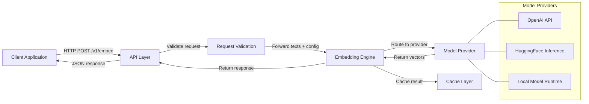
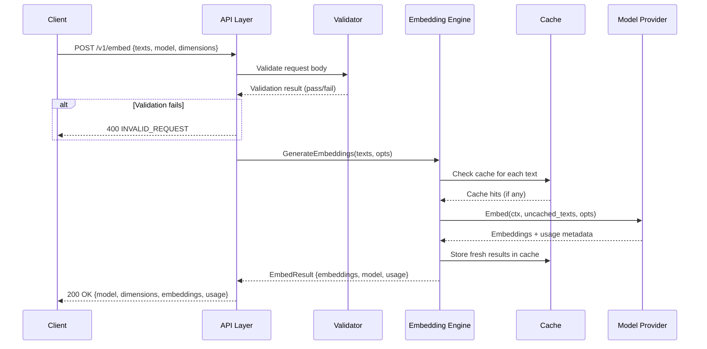

# Architecture

## Overview

Embedder Service is an HTTP microservice that accepts text input and returns vector embeddings. It provides a simple, provider-agnostic REST API that abstracts over multiple embedding model backends (OpenAI, HuggingFace, local models). Downstream consumers — such as RAG pipelines, semantic search engines, and recommendation systems — can integrate with a single, stable API regardless of which embedding model is in use.

The service is designed to be lightweight, horizontally scalable, and easy to operate in containerised environments.



## Component Breakdown

The service is composed of five core components:

### 1. API Layer

The HTTP server that receives client requests, validates input, and returns responses.

- **Framework:** Go standard library `net/http` (with a lightweight router such as `chi` or `gorilla/mux`)
- **Responsibilities:**
  - Route incoming requests to the appropriate handler
  - Parse and validate request bodies (JSON schema validation)
  - Serialise responses with consistent error formatting
  - Expose health (`/healthz`) and readiness (`/readyz`) endpoints
  - Handle CORS, request timeouts, and graceful shutdown
  <!-- TODO: confirm whether OpenAPI spec generation is desired -->

### 2. Embedding Engine

The core business logic that orchestrates embedding generation.

- **Responsibilities:**
  - Accept validated text inputs and model configuration
  - Select the appropriate model provider based on the request or server defaults
  - Optionally split inputs into provider-specific batch sizes
  - Aggregate results from multiple batches
  - Return normalised embedding vectors with metadata
  - Handle provider failures with fallback logic (if configured)

### 3. Model Provider Abstraction

A pluggable interface that isolates the embedding engine from specific model APIs.

- **Interface:** All providers implement a common `Embedder` interface:

  ```go
  // Embedder generates vector embeddings for a list of texts.
  type Embedder interface {
      // Embed returns embeddings for the given texts.
      Embed(ctx context.Context, texts []string, opts EmbedOptions) (*EmbedResult, error)

      // ModelInfo returns metadata about the model (name, dimensions, max tokens).
      ModelInfo() ModelInfo
  }
  ```

- **Concrete providers:**
  - `OpenAIEmbedder` — Calls the [OpenAI Embeddings API](https://platform.openai.com/docs/api-reference/embeddings) (`text-embedding-3-small`, `text-embedding-3-large`, `text-embedding-ada-002`)
  - `HuggingFaceEmbedder` — Calls the [HuggingFace Inference API](https://huggingface.co/docs/api-inference) for hosted sentence-transformer models
  - `LocalEmbedder` — Loads a HuggingFace model (e.g., via ONNX Runtime or a Go-native runtime) for offline inference
  <!-- TODO: evaluate additional providers (Cohere, Voyage AI, Azure OpenAI) -->

### 4. Cache Layer

An optional caching layer to avoid re-computing embeddings for identical inputs.

- **Backends:**
  - **In-memory** — Simple LRU cache for single-instance deployments (default)
  - **Redis** — Distributed cache for multi-instance deployments
- **Cache key:** Hash of `(model_id, text, dimensions)` to ensure correctness
- **TTL:** Configurable, defaults to 1 hour
- <!-- TODO: decide whether cache warming or pre-population is needed -->

### 5. Configuration

Manages service settings from environment variables and/or config files.

- **Sources** (in order of precedence):
  1. Environment variables
  2. Configuration file (`config.yaml` in the working directory)
  3. Built-in defaults
- **Hot-reload:** <!-- TODO: decide whether config hot-reload is needed -->
- Settings include: listen address, default model, dimensions, cache config, provider API keys, and logging level.

## Data Flow

```
┌──────────┐      ┌──────────────┐      ┌────────────────┐      ┌──────────────┐      ┌──────────────┐
│  Client   │─────►│  API Layer   │─────►│   Request      │─────►│  Embedding   │─────►│  Model       │
│           │      │  (HTTP)      │      │   Validation   │      │  Engine      │      │  Provider    │
└──────────┘      └──────────────┘      └────────────────┘      └──────────────┘      └──────────────┘
                                                                                             │
                                                                                             ▼
┌──────────┐      ┌──────────────┐      ┌────────────────┐      ┌──────────────┐      ┌──────────────┐
│  Client   │◄─────│  API Layer   │◄─────│   Response     │◄─────│  Embedding   │◄─────│  Vectors     │
│           │      │  (JSON)      │      │   Serialiser   │      │  Engine      │      │  (float[])   │
└──────────┘      └──────────────┘      └────────────────┘      └──────────────┘      └──────────────┘
```

### Step-by-step

1. **Request received** — The API layer receives a `POST /v1/embed` request with a JSON body containing `texts`, an optional `model`, and optional `dimensions`.

2. **Validation** — The request body is validated:
   - `texts` must be a non-empty array of strings.
   - Each text must not exceed the model's maximum input token length.
   - `dimensions` (if provided) must be within the model's supported range.
   - On failure, a `400 INVALID_REQUEST` error is returned immediately.

3. **Cache lookup** — If caching is enabled, the cache is queried for each input text using a key derived from `(model, text, dimensions)`. Cached results are returned without calling the provider.

4. **Provider selection** — The embedding engine resolves the requested model to a configured provider. If no model is specified, the server default is used. If the model is not available, a `422 MODEL_NOT_FOUND` error is returned.

5. **Batch embedding** — The provider's `Embed()` method is called with the validated texts (minus any cache hits). The provider may internally batch the request if it exceeds its per-request limit.

6. **Response construction** — The embedding engine assembles the response:
   - Merges cache hits with fresh provider results.
   - Returns the embeddings in the same order as the input texts.
   - Attaches model metadata and usage information.

7. **Cache write** — Fresh results are written to the cache with the configured TTL.

8. **Response sent** — The API layer serialises the response as JSON and returns it to the client with a `200 OK` status.



## Technology Choices

<!-- TODO: confirm the tech stack with the team before implementation begins -->

| Component | Proposed Choice | Rationale | Alternatives Considered |
|---|---|---|---|
| **Language** | Go 1.22+ | Fast compilation, single binary deployment, excellent concurrency support, low memory footprint | Python (rich ML ecosystem but heavier runtime), Rust (maximal performance but steeper learning curve) |
| **HTTP Framework** | `net/http` + `chi` router | Go standard library for transport; `chi` adds lightweight routing, middleware, and context support without bloat | `gorilla/mux` (unmaintained), `gin` (more opinionated), `fiber` (requires different ecosystem) |
| **Model Provider — Cloud** | OpenAI Embeddings API | Industry-standard, high quality, well-documented, supports dimension truncation | HuggingFace Inference API, Cohere, Voyage AI |
| **Model Provider — Local** | ONNX Runtime (via `onnxruntime-go`) | Cross-platform, fast CPU/GPU inference, wide model support | Python subprocess (adds complexity), CGo bindings for C++ runtimes |
| **Vector Cache** | In-memory LRU (default), Redis (distributed) | Zero dependencies for single-instance; Redis for production scale | Memcached (no native TTL-per-key), BadgerDB (embedded but overkill) |
| **Configuration** | Environment variables + YAML file | 12-factor app compliance; file-based config for complex deployments | TOML, JSON (less human-readable), Viper (adds dependency weight) |
| **Logging** | `log/slog` (Go 1.21+) | Structured logging in the standard library; no third-party dependency | `zap` (faster but external), `zerolog` (external) |
| **Testing** | `testing` stdlib + `testify` | Standard library foundation; `testify` for assertions and mocks | `gomock` (generated mocks), `mockery` (more boilerplate) |

## Directory Structure

<!-- TODO: adjust as the implementation evolves -->

```
embedder-service/
├── cmd/
│   └── server/
│       └── main.go                 # Application entry point
├── internal/
│   ├── api/
│   │   ├── handler.go              # HTTP route handlers
│   │   ├── middleware.go           # CORS, logging, auth middleware
│   │   ├── request.go              # Request types and validation
│   │   └── response.go             # Response types and serialisation
│   ├── embedder/
│   │   ├── engine.go               # Embedding engine (orchestration)
│   │   ├── embedder.go             # Embedder interface definition
│   │   ├── openai.go               # OpenAI provider implementation
│   │   ├── huggingface.go          # HuggingFace provider implementation
│   │   ├── local.go                # Local model provider implementation
│   │   └── registry.go             # Model name → provider registry
│   ├── cache/
│   │   ├── cache.go                # Cache interface
│   │   ├── memory.go               # In-memory LRU cache
│   │   └── redis.go                # Redis cache implementation
│   └── config/
│       ├── config.go               # Configuration struct and loader
│       └── defaults.go             # Default values
├── pkg/
│   └── logger/
│       └── logger.go               # Shared structured logger setup
├── configs/
│   └── config.yaml                 # Example configuration file
├── docs/
│   ├── api.yaml                    # OpenAPI / Swagger specification
│   └── architecture.md             # This file
├── scripts/
│   └── dev.sh                      # Local development helper script
├── go.mod                          # Go module definition
├── go.sum                          # Dependency checksums
├── Dockerfile                      # Container build
├── .dockerignore                   # Docker build exclusions
├── .gitignore                      # Git exclusions
├── Makefile                        # Build, test, lint targets
├── README.md                       # Project overview and usage
└── LICENSE                         # License file
```

### Key Design Decisions

- **`cmd/`** contains the application entry points. Multiple binaries (e.g., `server`, `migrate`) can live here.
- **`internal/`** holds all private application code that cannot be imported by external Go modules. This is where the core business logic lives.
- **`pkg/`** contains packages that could potentially be reused by other projects (e.g., a shared logger or utility library).
- **`configs/`** stores configuration files and templates, separate from source code.
- **`docs/`** holds documentation assets like the OpenAPI spec.
- <!-- TODO: add a `test/` or `testdata/` directory for integration test fixtures -->

## Deployment Considerations

<!-- TODO: expand this section based on the team's infrastructure -->

### Horizontal Scaling

The stateless API design allows multiple instances to run behind a load balancer. For distributed caching, configure Redis as the cache backend.

### Resource Requirements

<!-- TODO: profile and document actual resource usage -->

- **CPU:** Minimal for API and orchestration; depends on local model inference if enabled
- **Memory:** ~50 MB base; increases with cache size and loaded models
- **Network:** Outbound HTTPS to model provider APIs; no inbound dependencies

### Observability

<!-- TODO: add Prometheus metrics and distributed tracing once implementation begins -->

- Structured JSON logs via `log/slog`
- Health and readiness probes for container orchestrators
- <!-- TODO: add Prometheus `/metrics` endpoint -->
- <!-- TODO: add OpenTelemetry trace propagation -->

## Security Considerations

<!-- TODO: expand based on the team's security requirements -->

- **API keys** — Provider API keys are loaded from environment variables and never exposed in responses or logs.
- **Input sanitisation** — Text inputs are validated for length and encoding before being passed to embedding providers.
- **Rate limiting** — <!-- TODO: implement rate limiting middleware -->
- **TLS** — <!-- TODO: document TLS termination strategy (reverse proxy vs built-in) -->
